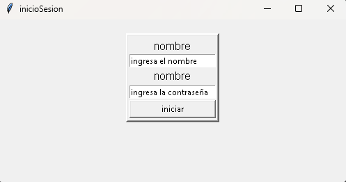
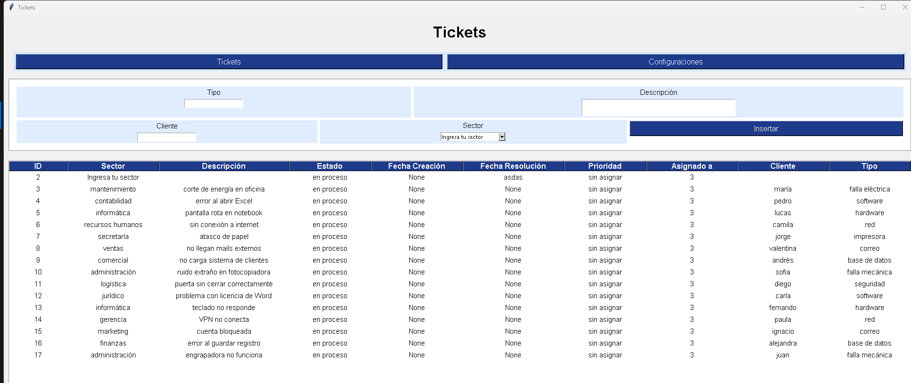
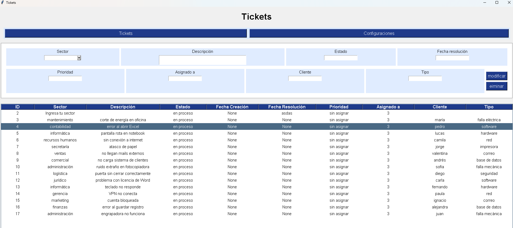

#  Gestor de Tickets de Soporte

Aplicación de escritorio para gestionar tickets de soporte técnico. Permite registrar, visualizar y administrar solicitudes con interfaz gráfica en Tkinter y base de datos SQLAlchemy. Ideal para equipos internos que manejan tareas y reportes.

---

##  Funcionalidades principales

- Registro de tickets con campos como sector, descripción, estado, prioridad, cliente y tipo
- Visualización en tabla interactiva con scroll horizontal
- Validación de campos y manejo de errores
- Interfaz gráfica clara y adaptable a pantalla completa
- Estructura modular para futuras mejoras

---

##  Tecnologías usadas

- Python 3.x
- Tkinter
- SQLAlchemy
- SQLite

---

## ventanas del sisitema

aqui los empleados de la empresa podran iniciar sesion para acceder a la pagina de tickets



aqui es donde los empleados podran realizar un ingreso de ticket donde pondran el sector o otro diferente al suyo 
una descripcion para tener nocion del problema etc



esta se despliega al momento de seleccionar un registro en la tabla pero estas opciones solo estan disponibles para los encargados de soportes o mantencion


## mer(entidad relacion)


personas 1Nm tickets

tickets mN1 personas


## Mejoras pendientes

Este proyecto ya cuenta con integración de SQLAlchemy y control de acceso por roles de usuario. Las mejoras planificadas incluyen:

Optimizar la estructura de la base de datos, eliminando campos innecesarios y ajustando relaciones para mayor coherencia. 

Agregar validaciones más robustas y manejo automático de errores en formularios.

Incorporar reportes o estadísticas para visualizar métricas de tickets por estado, prioridad o sector.

Preparar el proyecto para migración a Django si se decide escalar o llevarlo a web en el futuro.

##mejoras terminadas

interfaz adaptativa para que se ajuste bien tanto a pequeñas como a grandes pantallas


##  Instalación

```bash
git clone https://github.com/antoniobussines/tickets_soporte.git
cd ticket gestion
python run.py

